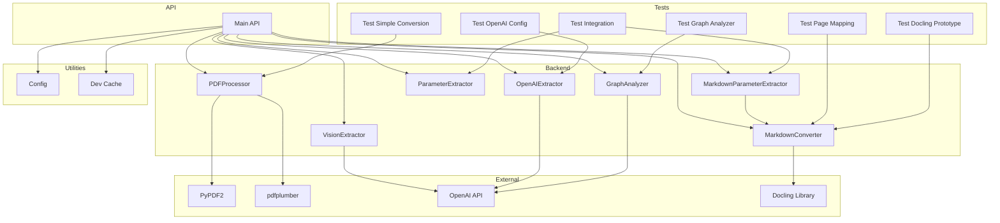

    

    <b>Automatic Architecture Diagrams from Code</b> 
    <a href="https://github.com/swark-io/swark">GitHub</a> • <a href="https://swark.io">Website</a> • <a href="mailto:contact@swark.io">Contact Us</a>

## Usage Instructions

1. **Render the Diagram**: Use the links below to open it in Mermaid Live Editor, or install the [Mermaid Support](https://marketplace.visualstudio.com/items?itemName=bierner.markdown-mermaid) extension.
2. **Recommended Model**: If available for you, use `claude-3.5-sonnet` [language model](vscode://settings/swark.languageModel). It can process more files and generates better diagrams.
3. **Iterate for Best Results**: Language models are non-deterministic. Generate the diagram multiple times and choose the best result.

## Generated Content
**Model**: GPT-4o - [Change Model](vscode://settings/swark.languageModel)  
**Mermaid Live Editor**: [View](https://mermaid.live/view#pako:eNqNVcFunDAQ_RXL5-SS4x4ibUMbrdSoSEl7gRy8MLtrBWzLmDQ0yr93wBCMbVC44HnzxozfzJh3WsgS6I7m4qyZupCnJBcEn6Y9WuAbK15AlBbtnzT5kWpZQNNInbnG88z5wxsuxfc3o1lhkObZDvOB6ZdS_hV3UryCNqCzAImwU6ZZDeibP7HucuIjcZv8XwrE_jCTPdth3vdi7QWrun94hoU1sgYRPXGfoDHNvElvPvJaVWAP34uW9SCxKJnh52VUys7wwJTi4mwDeoCMiMe1h8CtTnwkW4RYyGMfhAFM1nym4gAedanBQB4g4ikx8RNZVJgeNpCRplNgQ0aUfMIb-u3Tg9scXCCQ9e_esxH32_CKGw6O9qMegQYJvN6x4gIZLsiw2tgXOwM0HtbpuA5H5CazL2dbVZ5U1dZHFGpeBp03NpxzmiElq1A2KfWTHzXTXZjXqAi5vr5djG3o9QY0JARTuU4JJyqSzRc43rCFhEW_hW5byhCfKjqp5CpjkxuKteKcqzXFe9o5uc918MSzedjy-aRQmrUC2DhPpsjnFzpF_LFrZ6VnvLtmqzX8q2a9pt4186VmisVscUMNIt0Tu5TWjkivaA26ZrzEv-d7Ts0FasjpjuS0hBNrK5PTDyS1qmQGEs4w05rujG7hirLWyMdOFJOtZXu-0N2JVQ18_Ady84mH) | [Edit](https://mermaid.live/edit#pako:eNqNVcFunDAQ_RXL5-SS4x4ibUMbrdSoSEl7gRy8MLtrBWzLmDQ0yr93wBCMbVC44HnzxozfzJh3WsgS6I7m4qyZupCnJBcEn6Y9WuAbK15AlBbtnzT5kWpZQNNInbnG88z5wxsuxfc3o1lhkObZDvOB6ZdS_hV3UryCNqCzAImwU6ZZDeibP7HucuIjcZv8XwrE_jCTPdth3vdi7QWrun94hoU1sgYRPXGfoDHNvElvPvJaVWAP34uW9SCxKJnh52VUys7wwJTi4mwDeoCMiMe1h8CtTnwkW4RYyGMfhAFM1nym4gAedanBQB4g4ikx8RNZVJgeNpCRplNgQ0aUfMIb-u3Tg9scXCCQ9e_esxH32_CKGw6O9qMegQYJvN6x4gIZLsiw2tgXOwM0HtbpuA5H5CazL2dbVZ5U1dZHFGpeBp03NpxzmiElq1A2KfWTHzXTXZjXqAi5vr5djG3o9QY0JARTuU4JJyqSzRc43rCFhEW_hW5byhCfKjqp5CpjkxuKteKcqzXFe9o5uc918MSzedjy-aRQmrUC2DhPpsjnFzpF_LFrZ6VnvLtmqzX8q2a9pt4186VmisVscUMNIt0Tu5TWjkivaA26ZrzEv-d7Ts0FasjpjuS0hBNrK5PTDyS1qmQGEs4w05rujG7hirLWyMdOFJOtZXu-0N2JVQ18_Ady84mH)

